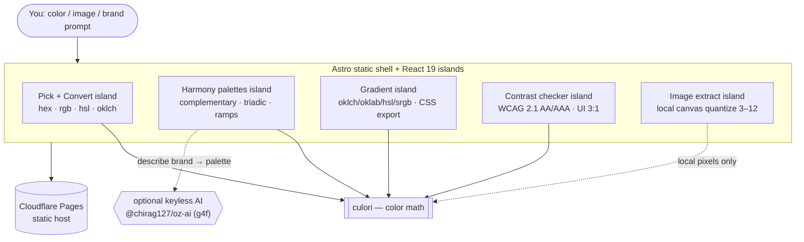

# oriz Color

> Color studio — pick, convert, harmonize, gradient, check contrast, and extract a palette from any image. 100% client-side.

[](LICENSE)
[](https://github.com/chirag127/oriz-color/stargazers)
[](https://github.com/chirag127/oriz-color/commits)
[](https://astro.build)

**Live app:** https://color.oriz.in · **About:** https://chirag127.github.io/oriz-color/ · **Repo:** https://github.com/chirag127/oriz-color

A browser-native color studio for designers and developers: pick a color, convert it across formats, generate harmony palettes, build multi-stop gradients, check WCAG contrast, and lift dominant colors out of any image. Every transform runs locally — images never leave your device (extraction runs on a local `<canvas>`), and the optional AI palette suggestions degrade gracefully when off.

⭐ If this is useful, please [star the repo](https://github.com/chirag127/oriz-color/stargazers) — it helps others find it.

## How it works



## Features

- **Pick + Convert** — native color picker; live conversion across hex / rgb / hsl / oklch, copy any format.
- **Harmony palettes** — complementary, analogous, triadic, tetradic, split-complementary, monochromatic, shades + a tint/shade ramp. Optional AI "describe a brand → palette".
- **Gradient** — multi-stop, angle control, oklch / oklab / hsl / srgb interpolation, CSS export, sampled stops.
- **Contrast** — WCAG 2.1 ratio with AA/AAA (normal + large) and UI 3:1 pass matrix, live preview, swap.
- **Extract** — drag-drop or pick an image, quantize its dominant colors (3–12) locally, copy any.
- **PWA-installable** — core tools work offline after first load.

## Tech stack

- **Astro 6** static output — zero JS by default, HTML-first.
- **React 19** islands — interactivity only where needed.
- **Tailwind CSS v4** — utility styling with a bespoke per-site theme.
- **[culori](https://culorijs.org)** — the color-math engine (conversions, interpolation, ΔE).
- **Shared `@chirag127/oz-*` packages** — `oz-chrome` (shell/nav), `oz-tokens-base` (design tokens), `oz-ai` (keyless in-browser AI via g4f), `oz-file` (file helpers).
- **Vitest** — unit tests over the pure color logic.
- **Cloudflare Pages** — static hosting.

## Repo structure

```
oriz-color/
├── src/
│   ├── pages/          # Astro routes (index + tool pages)
│   ├── components/      # React islands (pick, harmony, gradient, contrast, extract)
│   ├── lib/            # color math wrappers, quantization, harmony helpers
│   ├── layouts/        # base HTML layout / meta
│   └── styles/         # Tailwind v4 entry + theme tokens
├── tests/             # Vitest specs (pure color logic)
├── public/            # static assets, icons, manifest
└── astro.config.mjs   # Astro config
```

## Screenshots

See the live app in action at **https://color.oriz.in**.

## Quick start

```bash
npm install --legacy-peer-deps
npm run dev       # local dev server
npm run test      # vitest — pure color logic
npm run build     # static build → dist/
npm run deploy    # build + wrangler pages deploy (Cloudflare Pages)
```

> Windows: use **npm** (pnpm skips `@esbuild/win32-x64` and the Astro build crashes).

## Configuration

Fully client-side — **no environment variables required**. The optional AI palette feature uses `@chirag127/oz-ai` (keyless g4f/gpt4free with multi-provider failover), so there is no API key to configure.

## Part of the oriz family

One of ~80 sites in the [oriz](https://blog.oriz.in) family — a fleet of small, fast, client-side tools that run **$0 on the Cloudflare free tier**.

> **Hosting:** the canonical live app is served from **Cloudflare Pages** at [color.oriz.in](https://color.oriz.in). GitHub Pages serves a separate info/landing page at [chirag127.github.io/oriz-color](https://chirag127.github.io/oriz-color/).

## Related projects

- [oriz-img](https://github.com/chirag127/oriz-img) — in-browser image toolkit (resize, crop, compress, convert).
- [oriz-text](https://github.com/chirag127/oriz-text) — writing-desk text toolkit.
- [oriz-invoice](https://github.com/chirag127/oriz-invoice) — GST-aware invoice generator.
- [oriz-chat](https://github.com/chirag127/oriz-chat) — free client-side AI chat.

## Contributing

Issues and PRs welcome. Conventional commits are the changelog.

## Status

Stable.

## License

MIT © 2026 Chirag Singhal · chirag@oriz.in
